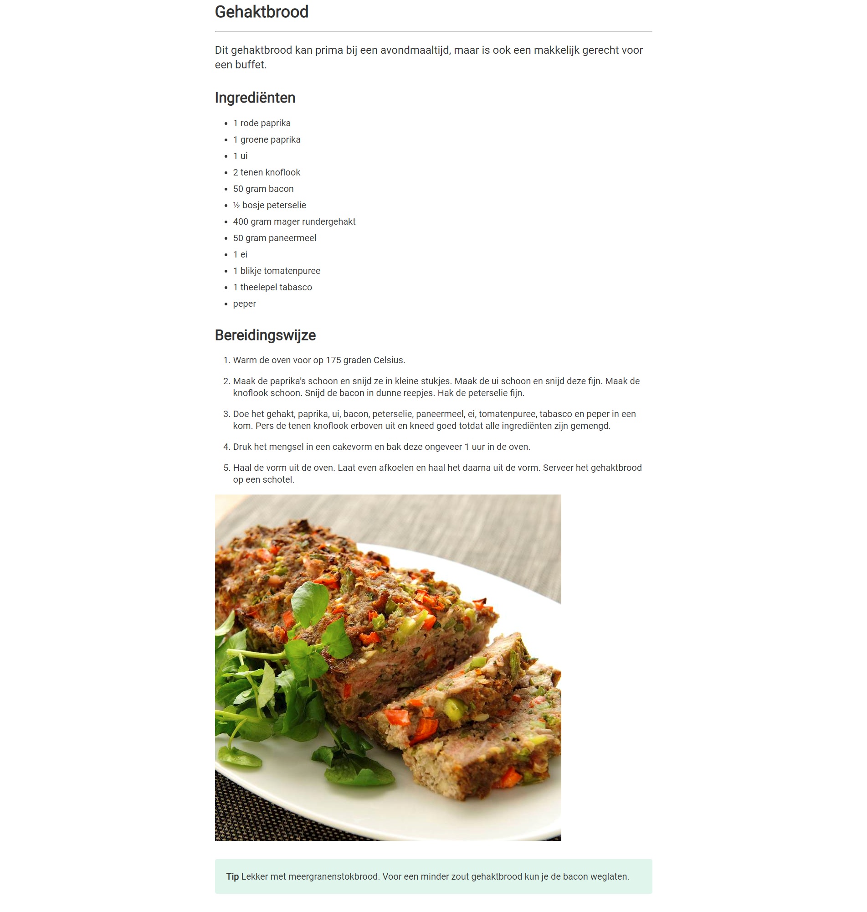

# B1W6O1 - Meatloaf
## Created by Ricardo Froeliger

For this week's assignment, you will try to copy the design (design.png) as close as possible using HTML and CSS. Because you try to copy the design as exactly as possible, there are very concrete technical requirements, read these carefully. The used picture of the meatloaf is also included. You will also make two new pages after working out the design. A recipe of an appetizer and a recipe of a dessert. So eventually we get a website for a three-course menu.

### Functional Requirements
* The customer can visit the webpage via his browser with the meatloaf recipe which exactly matches the design.
* The customer can visit the web page with the recipe for an appetizer via his browser.
* The customer can visit the web page with the recipe for a dessert via his browser.
* The customer can navigate between the different pages via a menu.

### Code Requirements
* Your HTML and CSS are neatly aligned.
* The font used is Roboto. This font is available from google, [Click here](https://fonts.google.com/specimen/).
* You make use of a div to center your whole page. You can do this by giving the div a margin of 'margin 0 auto'.
* The font size of the normal text is 20px and the line height is 26px.
* The title has a font size of 36px and a line height of 36px.
* The space between the different parts of content consists of 40px.
* The ingredients have a space of 10px between each other.
* The different steps of the preparation method have a space of 20 pixels between each other.
* The tip has a background with the color code #DEF6ED, a border radius of 4px and the paragraph is at least 25px from the edge of the element.
* You create a neat menu for each page so that you can navigate between the appetizer, the main course and the dessert.
* The web pages with the recipe for an appetizer and the web page with the recipe for a dessert do not have to meet the above technical requirements. You can style these pages yourself.

